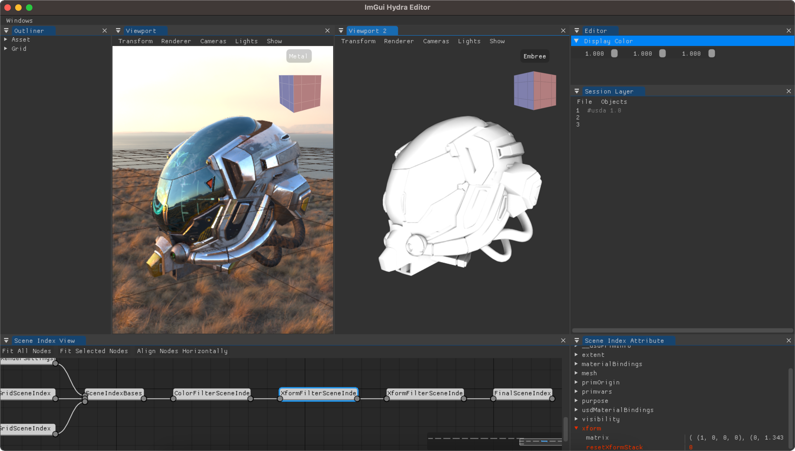

# Building

## Tested platforms

ImGUi Hydra has been developed on MacOS Sonora 14.5 (Macbook Air 2022 - M2).

## Dependencies

Required:
* gcc compiler
* [cmake v3.27](https://cmake.org/) or newer
* [OpenUSD v25.08](https://github.com/PixarAnimationStudios/OpenUSD) or newer

Embedded:
* [imgui v1.90.9](https://github.com/ocornut/imgui)
* [ImGuizmo v1.83](https://github.com/CedricGuillemet/ImGuizmo)
* [ImGuiFileDialog v0.6.7](https://github.com/aiekick/ImGuiFileDialog)
* [ImGuiColorTextEdit](https://github.com/BalazsJako/ImGuiColorTextEdit)

Optional (if OpenGL enabled):
* [glew](https://github.com/Perlmint/glew-cmake)
* [glfw v3.4](https://github.com/glfw/glfw)

## Getting Started

### Install dependencies

Make sure gcc and cmake are installed

```bash
gcc --version
cmake --version
```
If some version and info are printed after running the previous commands, gcc and cmake are installed. If you get `command not found` error, please be sure to install them first.

### Download OpenUSD

The easy way to get a pre-built version of USD is to download the one from the [Nvidia website](https://developer.nvidia.com/usd).

To build USD manually, go to the [OpenUSD release page](https://github.com/PixarAnimationStudios/OpenUSD/releases), download the last release available and build it (build info in the OpenUSD [README.md](https://github.com/PixarAnimationStudios/OpenUSD/blob/release/README.md)).

Don't forget to add the --embree flag to the build command if you wish to have access to the Embree renderer from ImGui Hydra Editor.


```bash
python3 USD/build_scripts/build_usd.py --embree /path/to/install
```

### Clone ImGuiHydraEditor

Clone the git project using the following command:

```bash
git clone --recurse-submodules https://github.com/raph080/ImGuiHydraEditor.git
```

The recursive flag will automatically include the following projects: glew, glfw, imgui, ImGuiColorTextEdit, ImGuiFileDialog, ImGuizmo

### Build ImGuiHydraEditor

Within the cloned ImGuiHydraEditor, create a build folder and run cmake from this newly created folder by specifying the root path to OpenUSD build:

```bash
mkdir build
cd build
cmake -Dpxr_DIR=/path/to/OpenUSD/build/folder -DOpenSubdiv_DIR=/path/to/OpenUSD/build/folder/lib/cmake/OpenSubdiv -DCMAKE_INSTALL_PREFIX=/path/to/install/folder ..
make
make install
```

You can also use the following flag to force the use of OpenGL (e.g. on Mac instead of Metal):
```bash
-DFORCE_OPENGL=ON
```

### Run ImGuiHydraEditor
   
if everything went well, 3 new folders are created in your `/path/to/install/folder`: `bin`, `include` and `lib`.

You can then run the ImGuiHydraEditor application as follow:

```bash
/path/to/install/folder/bin/ImGuiHydraEditor
```