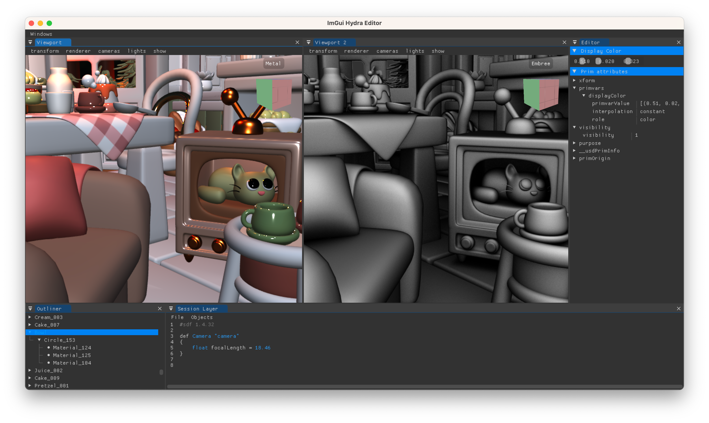
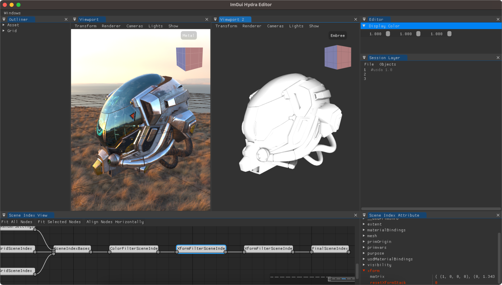

# ImGui Hydra Editor

ImGui Hydra Editor is a USD editor written in c++ with the ImGui and OpenUSD frameworks.


This project acts as a playground for USD, and most particularly Hydra. Therefore, the structure of the application remains simple and not over-engineered.

## Supported platforms

ImGui Hydra Editor was primarily developed on MacOS (Ventura 13.6) but was also built and tested on Linux (Centos 7).

## Dependencies

Required:
* gcc compiler
* [cmake v3.27](https://cmake.org/) or newer
* [OpenUSD v23.08](https://github.com/PixarAnimationStudios/OpenUSD) or newer

Embedded:
* [glew](https://github.com/Perlmint/glew-cmake)
* [glfw v3.3.8](https://github.com/glfw/glfw)
* [imgui v1.89.9](https://github.com/ocornut/imgui)
* [ImGuizmo v1.83](https://github.com/CedricGuillemet/ImGuizmo)
* [ImGuiFileDialog v0.6.5](https://github.com/aiekick/ImGuiFileDialog)
* [ImGuiColorTextEdit](https://github.com/BalazsJako/ImGuiColorTextEdit)

## Documentation

For more information about the code, please check the header files.

## Getting Started

### Install dependencies

Make sure gcc and cmake are installed

```bash
gcc --version
cmake --version
```
If some version and info are printed after running the previous commands, gcc and cmake are installed. If you get `command not found` error, please be sure to install them first.

### Download OpenUSD

The easy way to get a pre-built version of USD is to download the one from the [Nvidia website](https://developer.nvidia.com/usd).

To build USD manually, go to the [OpenUSD release page](https://github.com/PixarAnimationStudios/OpenUSD/releases), download the last release available and build it (build info in the OpenUSD [README.md](https://github.com/PixarAnimationStudios/OpenUSD/blob/release/README.md)).

Don't forget to add the --embree flag to the build command if you wish to have access to the Embree renderer from ImGui Hydra Editor.


```bash
python3 USD/build_scripts/build_usd.py --embree /path/to/install
```


### Clone ImGuiHydraEditor

Clone the git project using the following command:

```bash
git clone --recurse-submodules https://github.com/raph080/ImGuiHydraEditor.git
```

The recursive flag will automatically include the following projects: glew, glfw, imgui, ImGuiColorTextEdit, ImGuiFileDialog, ImGuizmo

### Build ImGuiHydraEditor

Within the cloned ImGuiHydraEditor, create a build folder and run cmake from this newly created folder by specifying the root path to OpenUSD build:

```bash
mkdir build
cd build
cmake -DPXR_USD_LOCATION=/path/to/OpenUSD/build/folder -DCMAKE_INSTALL_PREFIX=/path/to/install/folder ..
make
make install
```

### Run ImGuiHydraEditor
   
if everything went well, 3 new folders are created in your `/path/to/install/folder`: `bin`, `include` and `lib`.

You can then run the ImGuiHydraEditor application as follow:

Linux:
```bash
export LD_LIBRARY_PATH=/path/to/OpenUSD/build/folder/lib:/path/to/OpenUSD/build/folder/lib64:$LD_LIBRARY_PATH
./ImGuiHydraEditor
```

MacOS:
```bash
export DYLD_LIBRARY_PATH=/path/to/OpenUSD/build/folder/lib:$DYLD_LIBRARY_PATH
./ImGuiHydraEditor
```

You can optionally load a USD file directly using the following command:
```bash
./ImGuiHydraEditor /input/file.usd
```

## Viewport navigation

There is two way to navigate within the viewport: using the guizmo cube or the mouse and keyboard.


### Guizmo cube

Keep pressing on the guizmo cube and move the mouse to rotate around the focus point. Click on faces/edges/vertices from the cube to change the active camera position accordingly.

Note: guizmo cube navigation is not working properly with z up axis (see [Limitation section](#limitations)).

### Mouse and Keyboard

Here are the shortcut to navigate using the mouse and the keyboard:
* LMB + Alt: Rotate
* LMB + Shift: Pan
* RMB + Alt or Scroll wheel: Zoom
* F: Focus on selection
* W: Local translate
* E: Local rotate
* R: Local scale

## Additional renderers

Every renderer that implements a hydra render delegate can be used in this project to extends the renderer list.

Here is an example of 4 different renderers: Storm, Embree, [Cycle](https://github.com/blender/cycles) and [Arnold](https://github.com/Autodesk/arnold-usd).

Once the custom render delegates are build, don't forget to set the `PXR_PLUGINPATH_NAME` environment variable before launching the application to make use of them.



## And more

Explore the menu bars of the application and viewports, you may find useful fonctionalities such as:
* Create new objects in the scenes (Camera, Cube, ...)
* Create new views in the main window
* Switch the active camera to the viewport
* Show/Hide the grid
* Show/Hide ambient light, dome light
* Set global/local transform tool
* ...

## Limitations

There is currently some limitations

* ImGuizmo bug: glitchy navigation by using the gizmo cube when the stage up axis is Z (Z up axis is hardcoded in ImGuizmo)
* ImGuizmo bug: guizmo cube not working if multiple viewports and selection is empty
* Instances editing (e.g. translate) is not currently supported
* Single selection
* No Animation
* Simple events (no signal/slot implementation)
* Instanceable not visible in Outliner
* Instanceable cannot be selected (if so selection will switch to parent)
* No Undo
* Grid is on a separate layer at the back
* Does not keep multiple instances of same view when relaunched

## Next steps

Here are the next steps that are planned in order to improve the tool and discover more about Hydra:
* Switch from UsdImagingGLEngine to HdEngine or HdxTaskController
  * Allows multiple scene delegates
  * Add the grid dynamically to the RenderIndex
  * Abstract the Model to Hydra Objects (not USD object anymore)